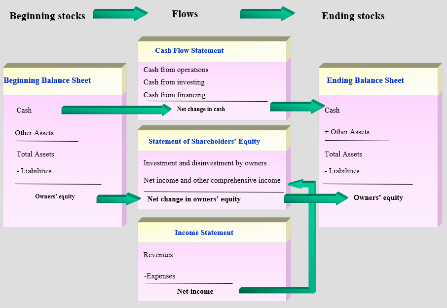

# Grading

Class 10%

HW 10%

Project 10%

30% Mid-term (10.29)

40% Final

# Intro

**会计 Accounting** ：an **information system** aims to

1. Measure business activities
2. Processes data into reports
3. Communicates results to financial statement users

会计分类：

- **财务会计 Financial Accounting** 为外部客户（external users）提供信息。外部客户包括：
  - 投资者 Investors
  - 债权人 Creditors （银行、供应商、农民工）
  - 政府 Government
  - 大众 The public
- **管理会计 Managerial Accounting** 为内部客户（internal users）提供如下会计信息：
  - 预算 Budgets
  - 预测 Forecasts

企业组织形式：

|                                         | 个人独资企业 Proprietorship | 合伙制企业 Partnership                                       | 公司制企业 Corporation               |
| --------------------------------------- | --------------------------- | ------------------------------------------------------------ | ------------------------------------ |
| Owner(s)                                | Proprietor - One owner      | Partners - two or more owners                                | Shareholders - generally many owners |
| Liability for business debts 债务承担者 | 个人                        | General partners：个人承担债务； Limited partners：不追查到个人 | 股东不被要求偿还债务                 |
| 缴税                                    | 个人所得税                  | 企业所得税（缴完员工个人所得税后再缴企业所得税，相当重征税，花费多于个人独资企业的） | 企业所得税                           |

**财务报表 Financial Statement** 四张基本报表（注意 **顺序** ，其中 **只有资产负债表是某一天的** ，相当于快照，其他表都是一个时间区间的）：

1. **利润表 Income Statement**
2. **所有者权益变动表 Statement of Changes in Equity** 
3. **资产负债表 Balance Sheet**
4. **现金流量表 Statement of Cash Flows**

**复式记账法 double-entry accounting**：任何一项交易都会至少影响两个账户，有借必有贷，借贷必相等。

**股东 Shareholder（Principal 委托人）**

**经理人 Manager（Agent 代理人）**

**代理问题 Agency Problem** 原因：

- 委托人和代理人利益不一致，存在委托义务（Delegate Authority）就必然会产生代理问题
- 信息不一致或物理距离

解决代理问题的方法：（以下两种方法都要用到会计信息）

- 监督：会计查账判断是否账务作假
- 激励：给管理层期权和股份，通常与会计利润挂钩

**会计信息 Accounting Information** 解决问题：

- **道德风险 Moral Hazard**：有经理人会有一些偷懒，会与自己的朋友亲信做交易，这些可能不是最大化股东利益的行为。
- **逆向选择 Adverse Selection**：风险小的项目能向银行贷到款（银行嫌贫爱富），风险大的项目向银行贷不到款只能发股来稀释自己的股权；逆向地，投资者也会根据风险来理性地投资，如果风险大，折扣率大，投钱可能低。

会计信息会直接影响资本市场的**交易量**（Trading Volume）和**股价**：

许多人都会等会计信息发布来进行股市交易。但会计信息不是唯一决定股价的因素（国家政策、公司政策、分析师评价、投资者看法、财经媒体报道、管理层变更、兼并收购发生、关联方交易等）

**会计信息使用者** ：

1. 最主要使用者（利益最相关）：投资者 Investors 和债权人 Creditors
2. 其他使用者：Employees（关心是否会破产）、Suppliers and trade creditors（供应方）、Customers、Government and its agencies、Public

**会计准测 Accounting Standard** ：增强不同国家的会计数字可比性，让投资者更好做出决策。例如**国际财务报告准则 International Financial Reporting Standards (IFRS)**

# Conceptual Framework

1. 目标 Objective：为投资者和债权人提供金融信息，方便决策。
2. 金融信息 Financial Information：提供 **economic phenomena** 的财务报告。economic phenomena 包括：
   - 经济资源 resources 
   - **权益 claims**
   - 两者的变动情况 changes in resources and claims
3. 特点 Qualitative Characteristic **保证了会计信息的实用性**：
   - 基本特点 Fundamental：
     - 相关性 Relevance 与制定决策息息相关
     - 如实反映 Faithful Representation 
   - 加强特点 Enhancing:
     - 可比性 Comparability 计算方法变动后，需要重新计算往年数据，避免与今年的结果不可比
     - 可验证性 Verifiability 报销所需要的票据很多就是为了增强可验证性
     - 及时性 Timeliness
     - 易理解 Understandability
4. 一个限制和两个假设：
   - Cost Constraint: data collection, processing, verifying and disseminating information，所以会有年报、季度财报，但是没有日报。
   - Accrual Accounting 信用卡等导致收入支出交易与现金流动不同步，先发生的应到账收入和应付款支出，一定日期后结算现金，（Transactions and other events are recognized when they occur and not when cash is received
     or paid）记账时要每次交易都有记录，而不是只记录现金交易
   - Going Concern 假设公司会持续经营，不会破产
5. 五大基本要素 Elements：（净利润 Net Income 不属于基本要素）
   - **资产 Assets** 是一种能带来未来可计量收益的经济资源（不包括人力资产，因为不能以货币准确计量，所以人力资产不会出现在财报中），包括Cash、债权 Account receivables、存货 inventory、current assets、PPE（Property, Plant, Equipment. The category of long-term or non-current assets）
   - **负债 Liabilities** 是需要偿还的义务 present obligations，是债权人的资产，包括 Bank loans，应付账款 Account payables
   - **所有者权益 Equity** 代表股东的剩余索取权 residual claim，是资产负债表中减掉资产和负债的剩余部分。由两块构成：
     - **股东初始投资 Share capital** 
     - **留存收益 Retained earnings**
   - **收入 Income** **包含**主营业务收入 **Revenue** 和额外收入 **Gains**（政府补贴、非自己经营业务收入，例如旅游公司破产前将大楼卖了得到的收入）
   - **费用 Expenses** 为业务相关的支出，例如salaries、rent expenses，**与之相对**的为**营业外支出 Losses**，例如罚款、厂房火灾、台风损失

# 会计恒等式

1. Balance Sheet Equation: **Assets = Liabilities + Equity**
   （Equity = Shareholders' Equity + Owners' Equity）
2. **Total Revenue and Gain - Total Expenses and Losses = Net Income (or Loss)** 净收入或净亏损
3. Beginning Balance of Retained Earnings +/- Net Income (or Net Loss) for the period - Dividends for the period = Ending Balance of Retained Earnings
   - 期初余额 + 净收入（或 - 净亏损）- 现金红利 = 期末余额
   - 代表 Net Income (or Loss) 与 Retained Earnings 的关系
   - 联系了利润表和所有者权益变动表

# 财务报表

Financial Statements

金融信息的流动方向：

**Income Statement** -Net income-> **Statement of Changes in Equity** -Ending equity (Share capital + Retained earnings)-> **Balance Sheet** -Cash-> **Statement of Cash Flows**

*箭头上的部分代表两个报表提供的相同信息

|                  | Categories                                                   | Bottom line                           | 备注                                                         |
| ---------------- | ------------------------------------------------------------ | ------------------------------------- | ------------------------------------------------------------ |
| 利润表           | Revenues and gains；Expenses and losses                      | Net income or net loss for the period | 也叫 Profit and Loss Statement (P&L)                         |
| 所有者权益变动表 | 企业与所有者间的交易 company's transaction with its owners   | Net change in owners' equity          | 为了简化，有的时候也可以用留存收益(Retained Earnings)变动表  |
| 资产负债表       | Assets，Liabilities，Shareholders' equity                    |                                       | 也叫做 Statement of Financial Position                       |
| 现金流量表       | Measures cash payments into three types of activities: Operating, Investing and Financing | Net change in cash                    | Change in Cash = Cash from Operations + Cash from Investing + Cash from Financing |

*参考图片：

